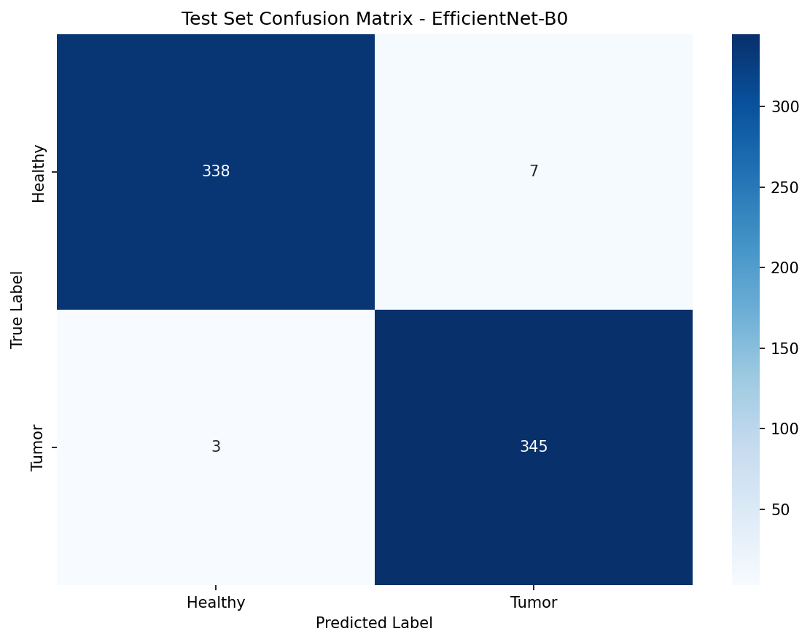

# Cantor-Dust-Challenge
## Overview
This is not a diagnosis interface, this is a research prototype. This is a AI that has been fine tuned using a kaggle dataset and is integrated in a web interface for tumor detections.Users can upload a brain CT scan image and receive a predicted tumor probability, and confidence level.

## Architecture
1. **User Input:** A user uploads a CT scan image via the web interface.
2. **Client Layer:** The **React Frontend** (Next.js + Tailwind CSS) handles file packaging, UX state, and loading UI.
3. **API Gateway:** The **FastAPI Backend** receives the payload via the `POST /predict` endpoint, acting as the primary gatekeeper for file validation (size, extension, decoding).
4. **Inference Engine:** Validated images are passed to the **EfficientNet-B0** model (fine-tuned specifically on brain CT scans) via PyTorch.
5. **Data Contract:** The model outputs a strictly validated **Structured JSON Response** via Pydantic:
   ```json
   {
     "predicted_label": "string",
     "tumor_probability": "float",
     "confidence": "high | medium | low",
     "requires_human_review": "boolean",
     "model_version": "string",
     "inference_time_ms": "integer",
     "timestamp": "datetime"
   }

### Flow Description

| Step | Component | Purpose |
|------|-----------|---------|
| 1 | React Frontend | User uploads CT scan image |
| 2 | FastAPI Backend | Validates file and runs inference |
| 3 | EfficientNet-B0 | Fine-tuned model makes prediction |
| 4 | JSON Response | Returns structured prediction data |
| 5 | SQLite Audit Log | Persists all inference requests |

---

## Demo Video
https://github.com/user-attachments/assets/aea8f738-c4a8-4fbb-b30a-c3d83d9ba464

---

## Tech Stack

| Layer | Technology |
|-------|-----------|
| Model | PyTorch, timm, EfficientNet-B0 |
| Backend | FastAPI, SQLAlchemy, SQLite |
| Frontend | Next.js, React, Tailwind CSS |
| Training | Jupyter Notebooks |
| Language | Python 3.12, TypeScript |

---

## Setup Instructions

### Prerequisites
- Python 3.12+
- Node.js 24+
- Git

### 1. Clone Repository
```bash
git clone https://github.com/RajwatSingh/Cantor-Dust-Challenge.git
cd Cantor-Dust-Challenge

# Create and activate virtual environment
python3 -m venv venv
source venv/bin/activate
# Windows: venv\Scripts\activate

# Install dependencies
pip install -r backend/requirements.txt

# Start backend server
cd backend
uvicorn app.main:app --reload --host 0.0.0.0 --port 8000

# Open a new terminal
cd frontend
npm install
npm run dev
```

## Access the Application

* **Frontend:** [http://localhost:3000](http://localhost:3000)
* **Backend API Docs (Swagger UI):** [http://localhost:8000/docs](http://localhost:8000/docs)
* **Inference History:** [http://localhost:3000/history](http://localhost:3000/history)

---

## Dataset Overview

| Property | Details |
| :--- | :--- |
| **Source** | Kaggle Brain Tumor CT Scan Images |
| **Total Images** | 4,618 |
| **Classes** | Healthy (2,300), Tumor (2,318) |
| **Class Balance** | 49.8% / 50.2% (well balanced) |
| **Modality** | CT scans only |
| **Image Format** | JPG, PNG |

---

## Model Information

* **Architecture Base:** EfficientNet-B0 (pretrained on ImageNet)
* **Framework:** PyTorch + `timm`
* **Task:** Binary classification (Healthy vs. Tumor)
* **Input Size:** 224x224 RGB
* **Version:** v0.1.0

### Why EfficientNet-B0?
* Provides an excellent tradeoff between strong accuracy and fast inference speed.
* Performs exceptionally well with transfer learning on medium-sized datasets (~4,600 images).
* Pretrained ImageNet weights provide a robust feature extraction baseline.
* Highly recommended for edge deployments and medical imaging classification tasks.

---

##  Training Details

| Parameter | Value |
| :--- | :--- |
| **Train/Val/Test Split** | 70% / 15% / 15% |
| **Optimizer** | Adam (lr=0.0001) |
| **Loss Function** | CrossEntropyLoss |
| **Batch Size** | 32 |
| **Total Epochs** | 15 |
| **Best Epoch** | 13 |
| **Best Val Accuracy** | 98.55% |

---

## Data Augmentation (Training Only)

To prevent overfitting and improve model generalization, the following augmentations were applied to the training set:
* Random horizontal flip (p=0.5)
* Random rotation (±10 degrees)
* Color jitter (brightness=0.2, contrast=0.2)
* Resize to 224x224
* Standard ImageNet normalization

##  Model Evaluation

### Test Set Results
The final model (`v0.1.0`) was evaluated on a strictly held-out test set of 693 CT scans. I just made one model for this one. 

| Metric | Score |
| :--- | :--- |
| **Accuracy** | 98.55% |
| **ROC-AUC** | 0.9993 |
| **Sensitivity (Tumor Recall)** | 99.14% |
| **Specificity (Healthy Recall)** | 97.97% |
| **F1 Score (Tumor)** | 0.9857 |
| **F1 Score (Healthy)** | 0.9854 |

### Confusion Matrix


---

##  Data Leakage Mitigation

### What I Did
* **Stratified 70/15/15 split with fixed random seed (42):** Maintains a 50/50 class balance across all splits and ensures results are 100% reproducible across all runs.
* **Test set isolated first:** Separated before any model decisions or preprocessing steps were made. Evaluated only once at the very end and never used for hyperparameter tuning.
* **Single modality selection:** Restricted to CT scans only (no MRI images mixed in). This prevents the model from taking "shortcuts" and learning the modality type instead of actual tumor features.
* **Fixed random seed (42):** Ensures identical splits on every environment setup.

### Remaining Risks Acknowledged
* **Near-duplicate images:** The dataset contains both `.jpg` and `.png` versions of some scans. 
* **Patient-level leakage:** No patient IDs were available in the source dataset

---

##  Confidence Policy

To ensure the system acts as a safe, human-in-the-loop screening tool, explicit confidence thresholds are enforced at the API level.

| Level | Tumor Probability | Action |
| :--- | :--- | :--- |
|  **High** | > 90% or < 10% | Trust prediction |
|  **Medium** | 70% - 90% or 10% - 30% | Note uncertainty |
|  **Low** | 30% - 70% | **Flag for human review** |

### Why These Thresholds?
* **Safety First:** Medical AI requires highly conservative uncertainty thresholds. 
* **Human-in-the-loop:** Low confidence predictions are automatically flagged for review via the backend's `requires_human_review` field.
* **Transparency:** Users are always shown the specific confidence level and probability percentages to support informed, clinical decision-making.

## API Reference

### `POST /predict`
Upload a CT scan image and receive a prediction.

**Request:**
```http
Content-Type: multipart/form-data
Body: file (image/jpeg or image/png, max 10MB)
```

**Response:**
```json
{
  "predicted_label": "tumor",
  "tumor_probability": 0.9234,
  "confidence": "high",
  "requires_human_review": false,
  "model_version": "v0.1.0",
  "inference_time_ms": 245,
  "timestamp": "2024-01-15T10:30:00.000Z"
}
```

---

### `GET /history`
Retrieve inference audit log.

**Response:** Array of all historical inference records

---

### `GET /stats`
Summary statistics for monitoring.

**Response:**
```json
{
  "total_inferences": 42,
  "flagged_for_review": 3,
  "review_rate": 7.14
}
```
## Trustworthy AI Features

To ensure safe, responsible, and transparent use of the model, the following features were engineered directly into the application:

* **Prominent Disclaimer:** Shown on every page, clearly stating that the tool is for non-clinical research use only.
* **Confidence Levels:** Every prediction explicitly includes a high, medium, or low confidence indicator.
* **Human Review Flagging:** Low-confidence predictions are automatically flagged for manual review via the backend `requires_human_review` field.
* **Audit Logging:** Every inference is permanently logged to an SQLite database with its timestamp, filename, model version, and exact output.
* **Careful Language:** The UI explicitly states *"Potential Tumor Detected"* rather than claiming a definitive clinical diagnosis.
* **Model Versioning:** Every prediction payload includes the specific model version (e.g., `v0.1.0`) for strict traceability.

---

##  Assumptions and Limitations

### Assumptions
* Input images are exclusively CT brain scans (not MRI or other modalities).
* Binary classification (Healthy vs. Tumor) is sufficient for this specific screening prototype.
* ImageNet pretrained weights transfer effectively to the grayscale CT scan domain.
* A 224x224 input resolution preserves sufficient diagnostic detail for the model to learn meaningful features.

### Limitations
* **Not a Medical Device:** This is a research prototype only and must not be used for clinical decision-making.
* **Binary Only:** The model cannot classify the specific *type* of tumor, its exact location, or its severity.
* **CT Scans Only:** The model has not been validated on MRI, PET, or X-Ray modalities.
* **No Patient Tracking:** There are no patient IDs in the dataset; the system cannot link or compare multiple chronological scans from the same patient.
* **Dataset Size:** The model was trained on ~4,600 images. Production-grade clinical models typically require millions of highly diverse scans.
* **No External Validation:** The model has not yet been tested on a completely independent, external clinical dataset (e.g., scans from a different hospital system).

---

##  Architectural Tradeoffs

| Decision | Choice | Reasoning |
| :--- | :--- | :--- |
| **Model Architecture** | EfficientNet-B0 *(vs. ViT)* | EfficientNet performs significantly better on medium-sized datasets and offers much faster training/inference speeds without requiring massive compute. |
| **Database** | SQLite *(vs. PostgreSQL)* | SQLite is simpler for local prototype setup and evaluation, whereas PostgreSQL would be required for a distributed production environment. |
| **Input Size** | 224x224 *(vs. higher res)* | Perfectly balances mathematical accuracy with rapid API inference speed. |
| **Split Ratio** | 70/15/15 *(vs. 80/10/10)* | Allocates more data to validation to ensure highly reliable Early Stopping and prevent overfitting. |
| **Confidence Thresholds** | 70% / 90% bands | Highly conservative thresholds, which is the standard requirement for medical context and safety. |
| **Modality** | CT only *(vs. CT + MRI)* | Enforcing a single modality prevents the model from learning distribution shortcuts instead of actual tumor pathology. |
| **Early Stopping** | Patience = 5 | Balances overall training compute time with maximum model quality and generalization. |

## 📁 Project Structure

```text
Cantor-Dust-Challenge/
├── backend/
│   ├── app/
│   │   ├── main.py              # FastAPI routes
│   │   ├── inference.py         # Model loading and prediction
│   │   ├── database.py          # Audit logging
│   │   ├── models.py            # Pydantic schemas
│   │   └── config.py            # Settings
│   └── requirements.txt
├── frontend/
│   ├── app/
│   │   ├── page.tsx             # Main upload page
│   │   └── history/
│   │       └── page.tsx         # Audit history page
│   ├── components/
│   │   ├── ImageUploader.tsx
│   │   ├── PredictionResult.tsx
│   │   ├── ConfidenceBadge.tsx
│   │   └── Disclaimer.tsx
│   └── lib/
│       └── api.ts               # Backend API client
├── models/
│   └── v0.1.0/
│       ├── best_model.pth
│       ├── test_results.json
│       └── confusion_matrix.png
├── notebooks/
│   └── 02_model_training.ipynb
├── data/                        
└── README.md
```
